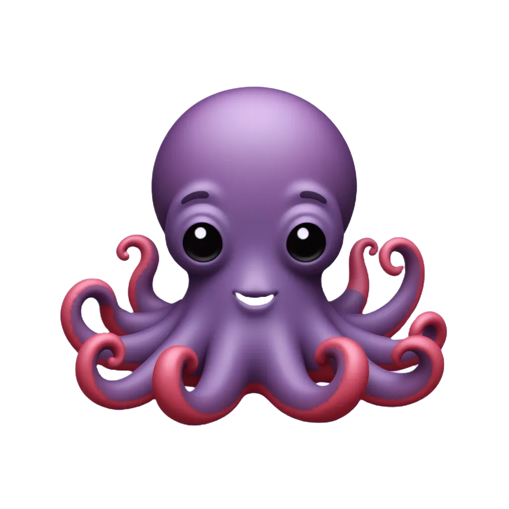

<html lang="en">
<head>
    <meta charset="UTF-8">
    <meta name="viewport" content="width=device-width, initial-scale=1.0">
    <title>Piano Pitch Training</title>
    
</head>
<body>

    

        
0Streak

        
0Strikes

    

    

        
Test Mode

        
        

            Start at Level: 
            <select id="level-select" onchange="changeStartingLevel()">
                <!-- Generated by JS -->
            </select>
        

        

        

        
        <button id="play-btn" onclick="prepareRound()">Start Game</button>
        <button id="begin-round-btn" onclick="startActualGame()">Begin Round</button>
        <button id="replay-btn" onclick="replaySound()">Replay Sound</button>
        
Explore all sounds before playing!

        

            <button class="chord-btn active red" id="btn-red" onclick="handleInput('red')">🦞</button>
            <button class="chord-btn active brown" id="btn-brown" onclick="handleInput('brown')">🐻</button>
            <button class="chord-btn active pink" id="btn-pink" onclick="handleInput('pink')">🐷</button>
            <button class="chord-btn active purple" id="btn-purple" onclick="handleInput('purple')"></button>
            <button class="chord-btn active orange" id="btn-orange" onclick="handleInput('orange')">🦊</button>
            <button class="chord-btn active yellow" id="btn-yellow" onclick="handleInput('yellow')">🐥</button>
            <button class="chord-btn active green" id="btn-green" onclick="handleInput('green')">🐸</button>
            <button class="chord-btn active teal" id="btn-teal" onclick="handleInput('teal')">🐬</button>
            <button class="chord-btn active grey-note" id="btn-grey" onclick="handleInput('grey')">🐘</button>
            <button class="chord-btn active darkorange" id="btn-darkorange" onclick="handleInput('darkorange')">🍊</button>
            <button class="chord-btn active darkgreen" id="btn-darkgreen" onclick="handleInput('darkgreen')">🥝</button>
            <button class="chord-btn active indigo" id="btn-indigo" onclick="handleInput('indigo')">🫐</button>
            <button class="chord-btn active lavender" id="btn-lavender" onclick="handleInput('lavender')">🍇</button>
            <button class="chord-btn active lightyellow" id="btn-lightyellow" onclick="handleInput('lightyellow')">🍍</button>
        

    

</body>
</html>
